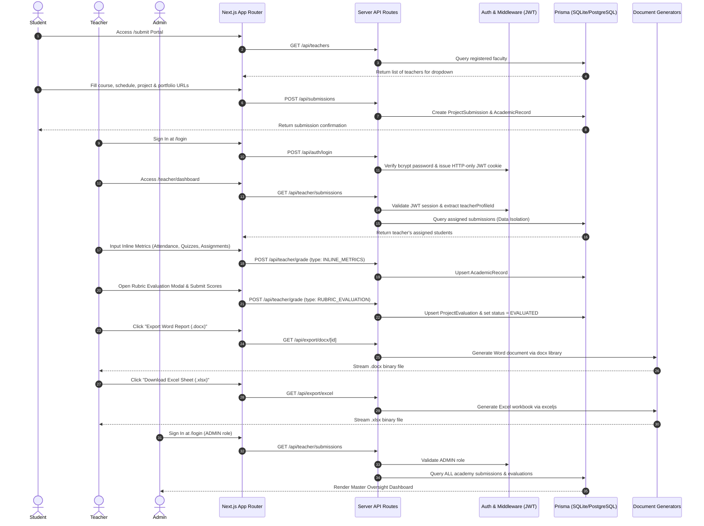

# Wessam Learning System (WLS) - Architecture Overview

This document provides a comprehensive technical overview of the file structure, component architecture, database schemas, external API routes, and data flow for **Wessam Learning System (WLS)**.

---

## 1. Directory & File Structure

```text
wls/
├── app/                           # Next.js 14+ App Router Routes & Pages
│   ├── admin/
│   │   └── dashboard/page.tsx    # Master Admin Oversight Dashboard
│   ├── api/                      # Backend API Route Handlers
│   │   ├── auth/
│   │   │   ├── login/route.ts    # POST: User authentication & JWT cookie issue
│   │   │   ├── logout/route.ts   # POST: Cookie session destruction
│   │   │   ├── me/route.ts       # GET: Current session user profile
│   │   │   └── register/route.ts # POST: Faculty registration
│   │   ├── export/
│   │   │   ├── docx/[id]/route.ts# GET: Stream Word (.docx) assessment report
│   │   │   └── excel/route.ts    # GET: Stream Excel (.xlsx) consolidated marksheet
│   │   ├── submissions/route.ts  # POST: Student project submission
│   │   ├── teacher/
│   │   │   ├── grade/route.ts    # POST: Inline metrics & rubric evaluation updates
│   │   │   └── submissions/route.ts # GET: Data-isolated submissions list
│   │   └── teachers/route.ts     # GET: Registered faculty dropdown list
│   ├── login/page.tsx            # Portal Login page
│   ├── register/page.tsx         # Teacher registration page
│   ├── submit/page.tsx           # Student Project Submission Portal
│   ├── teacher/
│   │   └── dashboard/page.tsx    # Isolated Teacher Dashboard & Grading Panel
│   ├── globals.css               # Global Tailwind CSS & Dark/Light design tokens
│   ├── layout.tsx                # Root layout (ThemeProvider, Navbar, Footer)
│   └── page.tsx                  # Home Landing Page
├── components/                    # Reusable React UI Components
│   ├── Footer.tsx                # Mandatory credit footer & LinkedIn profile link
│   ├── Navbar.tsx                # Sticky navbar with mobile navigation drawer
│   ├── StudentSubmissionForm.tsx # Student submission form with dynamic teacher dropdown
│   ├── TeacherGradingModal.tsx   # 7-criterion rubric evaluation modal & Word download
│   ├── TeacherInlineMetrics.tsx  # Inline attendance, participation, quiz & assignment inputs
│   ├── ThemeProvider.tsx         # Dark/Light mode React Context provider
│   └── ThemeToggle.tsx           # Dark/Light theme switcher button
├── lib/                           # Utility Libraries & Service Layer
│   ├── auth.ts                   # Bcrypt password hashing, JWT signing & verification
│   ├── export-docx.ts            # Official rubric Word (.docx) document builder
│   ├── export-excel.ts           # Consolidated marksheet Excel (.xlsx) workbook builder
│   └── prisma.ts                 # PrismaClient singleton instance
├── prisma/                       # Database Configuration & Migration Scripts
│   ├── schema.prisma             # Relational Database Schema definition
│   └── seed.ts                   # Seeder script for Master Admin & demo data
├── .env                          # Local Environment Variables
├── .env.example                  # Environment Variables Template
├── DEPLOYMENT.md                 # Vercel & PostgreSQL Deployment Guide
└── package.json                  # Dependencies & Script definitions
```

---

## 2. Database & Data Storage

- **ORM**: Prisma ORM v5.22.0
- **Database Engine**:
  - **Development**: SQLite (`dev.db` located at `file:./dev.db` for zero-setup instant local running).
  - **Production**: PostgreSQL (Neon DB / Supabase / Vercel Postgres ready via `provider = "postgresql"`).
- **Core Entities & Relations**:
  - `User`: Base user identity (`ADMIN`, `TEACHER`, `STUDENT`) with hashed password credentials.
  - `TeacherProfile`: Linked 1-to-1 with `User` for faculty metrics (department, designation).
  - `StudentProfile`: Linked 1-to-1 with `User` for enrolled students.
  - `ProjectSubmission`: Student submission records (course, schedule, project link, portfolio link) assigned to a specific `TeacherProfile`.
  - `AcademicRecord`: 1-to-1 relation with `ProjectSubmission` storing inline metrics (Participation: 10, Attendance: 10, Quizzes: 20, Assignments: 20).
  - `ProjectEvaluation`: 1-to-1 relation with `ProjectSubmission` storing 7-criterion rubric scores (Total 100 marks) and evaluator feedback.

---

## 3. Data Flow Diagram



---

## 4. Key Architectural Design Decisions

1. **Teacher Data Isolation**:
   - In `app/api/teacher/submissions/route.ts`, queries filter submissions strictly by `teacherId: session.teacherProfileId` when the caller has role `TEACHER`. Admin callers bypass this filter to view system-wide data.

2. **Decoupled Document Generation**:
   - `lib/export-docx.ts` uses `docx` to create structured OpenXML tables matching the 7 rubric criteria without needing headless browsers.
   - `lib/export-excel.ts` uses `exceljs` to generate styled worksheets with formulas, auto-column widths, cell borders, and custom header fills.

3. **Dual Theme Tokens**:
   - `app/globals.css` uses CSS variable custom tokens (`--background`, `--foreground`, `--card-bg`, `--card-border`, `--heading-color`).
   - Dark theme defaults to true `#000000` background with `#3b82f6` blue headings and `#ffffff` body text per specification.
