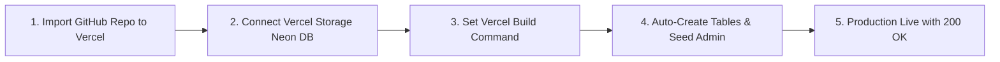

# Wessam Learning System (WLS) - 1-Click Automated Vercel & Neon DB Deployment Guide

This guide details how to make Vercel **automatically create database tables (`public.User`, `public.TeacherProfile`, etc.) and seed the Master Admin** during deployment with **ZERO manual database commands required**.

---

## 🚀 1-Click Automated Deployment Pipeline



---

## Step 1: Push Project to GitHub

```bash
git add .
git commit -m "Configure automated Vercel DB setup build command"
git push -u origin main
```

---

## Step 2: Deploy on Vercel & Connect Vercel Storage (Neon DB)

1. Open [vercel.com/new](https://vercel.com/new) and import your `wls` repository.
2. Under **Environment Variables**, add:
   - `JWT_SECRET`: `wls_super_secret_jwt_key_2026_wessam_learning_system_secure_786`
   - `ADMIN_EMAIL`: `wessamaftab@gmail.com`
   - `ADMIN_PASSWORD`: `Sami@n78600`
   - `ADMIN_NAME`: `Wessam Aftab (Master Admin)`
3. Under **Build & Development Settings**:
   - Turn ON **Override Build Command** and paste:
     ```bash
     npx prisma db push --accept-data-loss && npx tsx prisma/seed.ts && npx prisma generate && next build
     ```
4. Click **Deploy**.
5. Once created, click the **Storage** tab in your Vercel Project Dashboard $\rightarrow$ Click **Create Database** $\rightarrow$ Select **Postgres (Neon)** $\rightarrow$ Select your `wls` project and click **Connect**.

---

## Step 3: Trigger Redeploy (Automatic Table Creation & Seeding)

In your Vercel Dashboard, go to **Deployments** $\rightarrow$ click **Redeploy**.

During this build, Vercel will automatically:
1. Connect to Neon DB.
2. Run `prisma db push` to create all PostgreSQL tables (`public.User`, `public.TeacherProfile`, `public.StudentProfile`, `public.ProjectSubmission`, `public.AcademicRecord`, `public.ProjectEvaluation`).
3. Run `seed.ts` to create the Master Admin account (`wessamaftab@gmail.com` | `Sami@n78600`).
4. Generate Prisma Client and build Next.js.

Your site is now 100% functional with Teacher Registration and Master Admin Login working out of the box!
