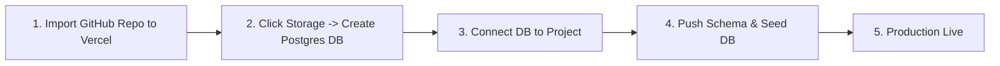

# Wessam Learning System (WLS) - Easiest Deployment via Vercel Storage (Postgres)

This guide details the **easiest, 1-click zero-config deployment method** for **Wessam Learning System (WLS)** using **Vercel Storage (Vercel Postgres)**.

---

## ⚡ 1-Click Vercel Storage Deployment Pipeline



---

## Step 1: Prepare `prisma/schema.prisma` for Vercel Storage

Update `prisma/schema.prisma` datasource block to use Vercel Storage pooling variables:

```prisma
datasource db {
  provider  = "postgresql"
  url       = env("DATABASE_URL")
  directUrl = env("DIRECT_URL")
}
```

---

## Step 2: Push Code to GitHub

```bash
git add .
git commit -m "Configure Vercel Storage deployment"
git push -u origin main
```

---

## Step 3: Deploy on Vercel & Attach Vercel Postgres Storage

1. Open [vercel.com/new](https://vercel.com/new) and import your `wls` repository.
2. In **Environment Variables**, add:
   - `JWT_SECRET`: `wls_super_secret_jwt_key_2026_wessam_learning_system_secure_786`
   - `ADMIN_EMAIL`: `wessamaftab@gmail.com`
   - `ADMIN_PASSWORD`: `Sami@n78600`
   - `ADMIN_NAME`: `Wessam Aftab (Master Admin)`
3. Click **Deploy**.
4. Once created, go to the **Storage** tab in your Vercel Project Dashboard.
5. Click **Create Database** $\rightarrow$ Select **Postgres**.
6. Select your `wls` project and click **Connect**.
   - *Vercel automatically provisions PostgreSQL and injects `DATABASE_URL` and `POSTGRES_PRISMA_URL` into your project settings!*

---

## Step 4: Seed Database with Vercel CLI (or local terminal)

Pull Vercel environment variables to your machine and push the schema:

```bash
# 1. Pull live Vercel Storage database variables
npx vercel env pull .env.production.local

# 2. Push Prisma Schema to Vercel Storage Postgres
npx prisma db push

# 3. Seed Master Admin & initial faculty
npx tsx prisma/seed.ts
```

---

## Step 5: Redeploy Project on Vercel

In your Vercel Dashboard, go to **Deployments** $\rightarrow$ click **Redeploy**. Your Next.js app is now 100% connected to Vercel Storage with zero errors!
